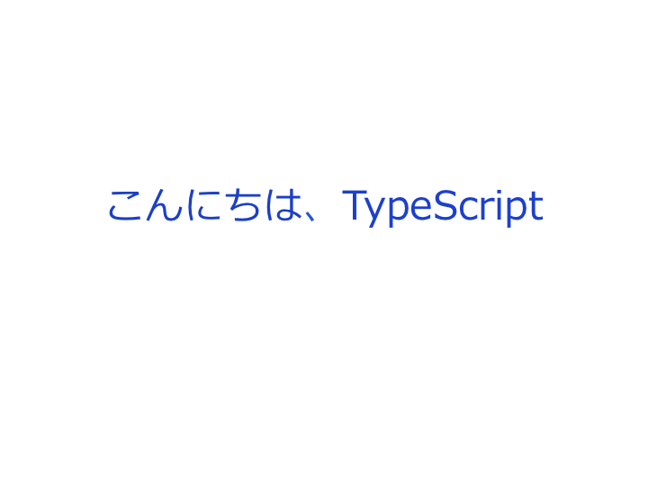
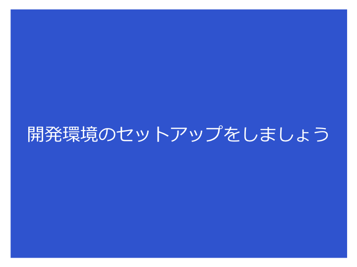
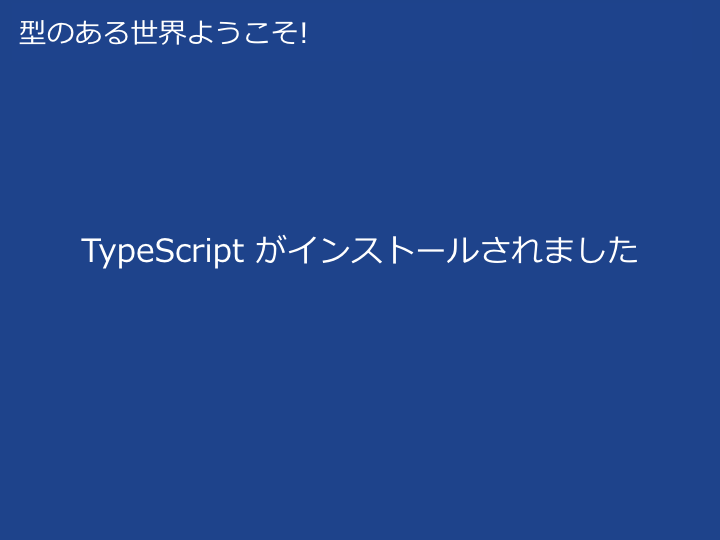
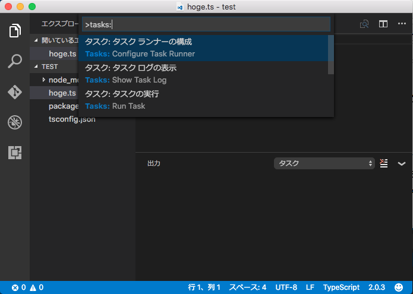
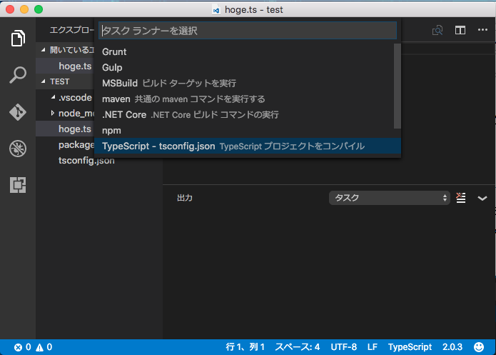
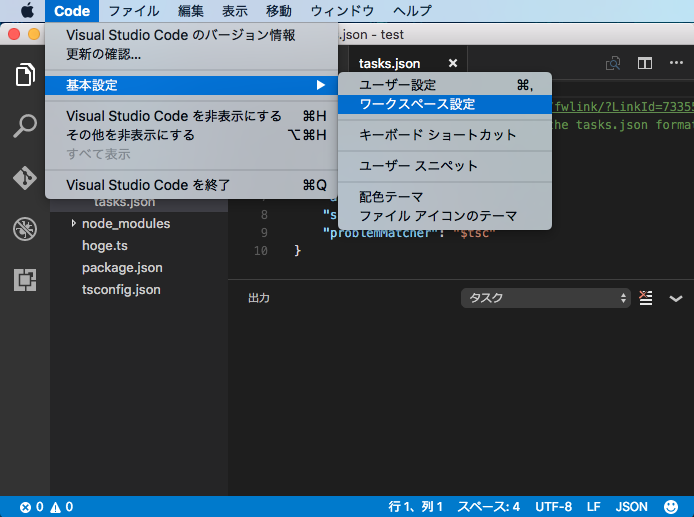
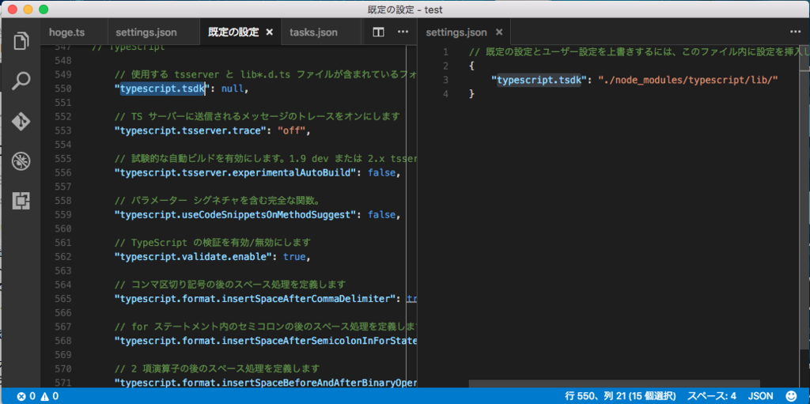
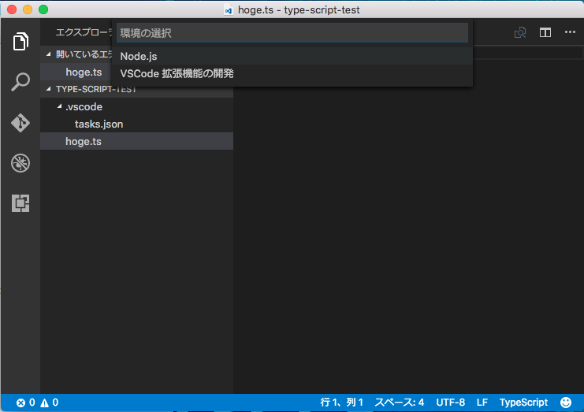
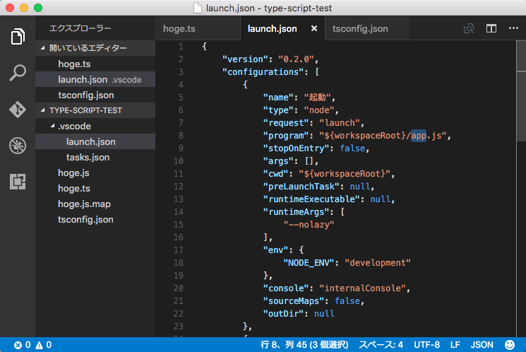
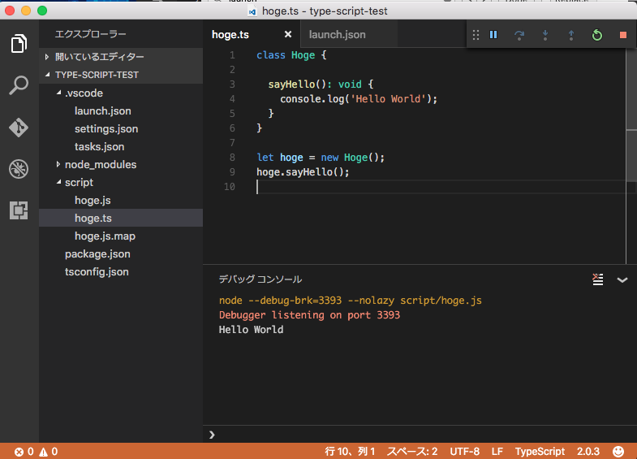

# TypeScript + express + Angular2 でつくるシングルページアプリケーション





**さあTypeScriptを始めましょう**


## もくじ

 * TypeScriptとは

 * 開発環境の準備

 * Hello World

 * TypeScriptの要素について

   - 型アノテーション

   - インタフェース

   - アクセス修飾子

   - 構造的部分型

   - async await

 * ライブラリと型定義のインストール
   
   - ライブラリのインストール
 
   - 型定義のインストール

 * CRUDアプリケーションの作成
   
  - 要件
  
  - ディレクトリ構成

  - データベースについて
  
  - MySQLのインストール


 * バックエンドの環境構築

  - Expressについて

  - Expressのインストール

  - Expressの型定義ファイルのインストール

  - 静的ファイルへのルーティング
  
  - エラーページへのルーティング
  
  - APIへのルーティング

  - モデルクラスの作成

  - コントローラの作成
  
  - サービスクラスの作成
  
  - DAOクラスの作成


 * フロントエンド開発の環境構築

  - Angular2 について
   
  - RxJSについて

  - Webpackの設定

  - package.jsonの設定

  - 設定クラスの作成

  - コンポーネントの作成

  - ディスパッチャの作成

  - 非同期通信処理


 * 参考文献


## TypeScriptとは

TypeScriptとは、Microsoftが開発した静的型付けAltJS(Altnative Javascript)です。

AltJSとはJavaScriptを生成するための言語です。TypeScript以外のAltJSにはCoffeeScriptやDartなどが存在します。

TypeScriptを使用する場合、プログラマはTypeScriptでコードを記述し、そのコードをJavaScriptにトランスパイルし、トランスパイル後のJavaScriptが実行されます。


## 開発環境の準備




### Node.jsのダウンロード

Node.jsをインストールされていない場合、以下のURLからダウンロードしインストールします。

[Node.js](https://nodejs.org/en/)


### Visual Studio Codeのダウンロード

今回は TypeScript の本家本元 Microsof が開発したエディタ Visual Studio Code を使用します。
以下のURLからダウンロードしインストールします。
Visual Studioと異なり、Visual Studio CodeはWindows版だけでなくMac版とLinux版も用意されています。

[Visual Studio Code](http://code.visualstudio.com/)


### TypeScriptのインストール

以下のコマンドを実行し、TypeScriptをインストールします。

```shell
$ npm install typescript -g
```

以下のコマンドで、バージョンが表示されたるかどうか確認しましょう。

```
$ tsc -v
```

これでTypeScriptで記述したファイルをJavaScriptにトランスパイルするこができるようになりました。




## Hello World


開発環境の準備ができたので、ごく簡単なプログラムを作成して開発環境がちゃんとできているか確認します。

ここは古典に倣い Hello World の文字列を表示するプログラムを作成します。

まずは適当な場所にプロジェクトディレクトリを作成し、Visual Studio Codeで開きます。
Visal Studio Code にはエディタ内でターミナルを開く機能があるので、以降のコマンドはそちらで実行すると楽。

### package.jsonの作成

まずは package.json を作成します。

```shell
$ npm init -y
```

実行後、プロジェクトディレクトリに package.json ができていることを確認しましょう。


### tsconfig.jsonの作成

tsconfig.jsonという名前のファイルをプロジェクトディレクトリに作成します。
これはトランスパイルする際のオプションなどを設定するファイルです。
とりあえず今回は以下の内容で作成します。

```json
{
  "compilerOptions": {
    "target": "ES5",
    "module": "commonjs",
    "moduleResolution": "node",
    "sourceMap": true,
    "emitDecoratorMetadata": true,
    "experimentalDecorators": true,
    "noImplicitAny": true,
    "suppressImplicitAnyIndexErrors": true,
    "lib": ["es2015", "dom"],
    "typeRoots": [
      "./node_modules/@types"
    ],
    "alwaysStrict": true
  },
  "compileOnSave": true,
  "exclude": [
    "node_modules",
    "**/*-aot.ts"
  ]
}
```


### Visual Studio Codeの設定

#### トランスパイルタスクの設定

Visual Studio Codeにはタスクランナーという機能があるので、この機能を使ってトランスパイルの実行を設定します。

Command + Shift + P キーを押してコマンドパレットを表示し、tasks と入力して「タスクランナーの構成」を選びます。





選択後、.vscode フォルダの下に task.json ができていることを確認します。


#### 使用するTypeScriptの設定

Visual Studio Code側でデフォルトで使用されるTypeScriptは1.8が指定されている場合があります。

既にTypeScript2がリリースされいてるので、最新のTypeScriptの機能を使用する場合、設定を変更する必要があります。

プロジェクトディレクトリ内のTypeScriptを使用する場合、以下のコマンドを実行します。

```
$ npm install typescript --save-dev
```

設定変更の手順は以下の通り。

「基本設定」→「ワークスペースの設定」



画面右側に、使用するTypeScriptのパスを設定します。




#### TypeScriptで書く

Hello World を表示するコードを書いていきます。今回は以下のよう hoge.ts というファイル名で以下ようなコードを書きました。

hoge.ts

```typescript
class Hoge {

  sayHello(): void {
    console.log('Hello World');
  }
}

let hoge = new Hoge();
hoge.sayHello();

```

#### トランスパイルタスクの実行

タスクの設定が正しく行われていれば、Command + Shift + B を押すと、トランスパイルが行われます。

トランスパイルに成功したら、ディレクトリ内に hoge.js ファイルが出力されいているはずです。


#### デバッグの設定

Visual Studio Codeではデバッグ設定を行うと、エディタ内でデバッグを行えます。
設定をするには　F5 キーを押し、Node.jsを選択します。



launch.json が開いたら、program属性の値(画像だと8行目)を実行するJavaScriptファイルに指定しなおします。



今回の場合

```json
"program": "${workspaceRoot}/hoge.js",
```

に変更します。変更後は保存を忘れずに。

また、デバッグをする際、ステップ実行もしたい場合、11行目の "sourceMaps"の値を false に設定します。


#### プログラムの実行

Visual Studo Codeで実行するにはエディタ画面左側の虫アイコンタブを選択し、実行ボタンを押します。

ソースコードに間違いがなく、設定が間違っていないなら、デバッグコンソールに 「Hello World」が出力されるはずです。




## TypeScriptの要素

TypeScriptはEcmaScript2015のスーパーセットです。
ここではEcmaScript2015には存在せず、TypeScriptに存在する要素で個人的に重要だと思うものをとりあげます。

### 型アノテーション

TypeScriptでは、型アノテーションを使用して、変数に静的に型を指定することができます。

以下のように型アノテーションは変数名の後に指定し、間に :(コロン) をつけます。

```typescript
let hoge: number = 1;
```

クラスのプロパティに指定する場合以下のようになります。

```typescript
clas Hoge {

  private fuga: string;
  
  constructor(fuga: string) {
    this.fuga = fuga;
  }

}
```

### インタフェース

EcmaScript2015に無い機能としてインタフェースがあります。インタフェースにはプロパティとメソッドの定義のみができ、実装することはできません。たとえば、以下のRunnableインタフェースは string型のnameプロパティと、booleanを返すrunメソッドが定義されています。

なお、トランスパイル後のJavaScriptにインタフェースと対応するコードは出力されません。

```typescript
interface Runnable {

  name: string;

  run(): boolean;
}
```

上記Runnableインタフェースを実装したTaskクラスを作る場合、以下ように implementsキーワードを使用します。

implementsキーワードを使用してインタフェースを指定することで、そのクラスにインタフェースで定義したプロパティとメソッドの実装を強制させることができます。インタフェースで定義したプロパティとメソッドがどれか1つでも実装されていない場合トランスパイルでエラーが発生します。

```typescript
class Task implements Runnable {

  name: string

  constructor(name: string) {
    this.name = name;
  }

  run(): boolean {
    let result = false;
    // 何か処理をする
    return result;
  }
}
```

### アクセス修飾子

TypeScriptでは、以下3種類のアクセス修飾子が使用できます。
何も指定しない場合、デフォルトで public となります。また、インタフェースで定義したプロパティとメソッドは自動的に public となり実装側で protected や private を指定するとトランスパイルエラーが発生します。

 * public ... 
 * protected ... 
 * private ... 

#### コンストラクのアクセス修飾子

TypeScript2.0から、以下のようにコンストラクタに private や protected が指定できるようになりました。(これまでは public しか指定できませんでした。)これにより、より安全に Sigleton パターンが使用できるようになりました。

```typescript
class Singleton {

  private static instance: Singleton;

  private constructor() {
    // do nothing
  }

  public static getInstance(): Singleton {
    if (!Singleton.instance) {
      Singleton.instance = new Singleton();
    }
    return Singleton.instance;
  }

}
```

### 構造的部分型

TypeScriptには、JavaやC#のようなクラスベースのオブジェクト指向プログラミング言語とは異なる考え方に、構造的部分型があります。

構造的部分型とは、型の派生関係を extends や implements からではなく、オブジェクトの構造から判断する仕組みのことです。

例えばJavaにおいて以下のような異なる2つの、但し構造は同じインタフェースがあり、それぞれに実装したクラスがあったとします。


Flyable.java

```java
public interface Flyable {
  void fly();
}
```

Dragon.java

```java
public interface Dragon {
  void fly();
}
```

Raven.java

```java
public class Raven implements Flyable {
    public void fly() {
        System.out.println("fly");
    }
}

```


BlueDragon.java

```java
public class BlueDragon implements Dragon {
  public void fly() {
    System.out.println("fly");
  }
}
```

その上で、以下のような処理を書いた場合、9行目でコンパイルエラーが発生します。

Main.java

```java
public class Main {

    public static void main(String[] args) {
        Main main = new Main();

        Flyable raven = new Raven();
        Dragon blueDragon = new BlueDragon();
        main.register(raven);
        main.register(blueDragon);
    }

    private void register(Flyable flyable) {
        // do something
    }

}
```

それはBlueDragonクラスがFlyableインタフェースを実装しておらず、Javaが構造ではなくextends や implements キーワードを元に型の派生関係を判断しているためです。

一方で、TypeScriptで似たようなコードを書いた場合トランスパイルエラーが発生しません。

Flyable.ts

```typescript
interface Flyable {

    fly(): void;
}

export default Flyable;
```

Dragon.ts

```typescript
interface Dragon {

    fly(): void;
}

export default Dragon;
```

Raven.ts

```typescript
import Flyable from './Flyable';

class Raven implements Flyable {

  fly(): void {
    console.log('fly');  
  }
}

export default Raven;
```

BlueDragon.ts

```typescript
import Dragon from './Dragon';

class BlueDragon implements Dragon {

  fly(): void {
    console.log('fly');  
  }
}

export default BlueDragon;
```

Javaのケースではコンパイルエラーが起きた行に相当する17行目があっても、TypeScriptではトランスパイルエラーは発生しません。これは構造が同じためです。

Main.ts

```typescript
import BlueDragon from './models/BlueDragon';
import Raven from './models/Raven';
import Flyable from './models/Flyable';

class Main {

  register(flyable: Flyable): void {
    flyable.fly();
  }
}

let main = new Main();

let raven = new Raven();
let blueDragon = new BlueDragon();
main.register(raven);
main.register(blueDragon);
```


## ライブラリと型定義のインストール

TypeScriptではJavaScriptのライブラリを使用できます。しかし、何もしなければライブラリのソースコードはJavaScriptで書かれているため型の情報がありません。そのため、ライブラリのインストールといっしょに型定義ファイルをインストールする必要があります。

### ライブラリのインストール

ここではjQueryのインストールを例に手順をみていきます。まずは、Express本体をインストールします。

```shell
$ npm install jquery --save
```

### 型定義のインストール

次に型定義ファイルをインストールします。型定義のインストールには、以前は tsd や Typings などのツールを使用していましたが、2.0からは npm だけで完結するようになりました。

```shell
$ npm install @types/jquery --save
```

型定義ファイルが既に存在するかどうかは
[TypeSearch](http://microsoft.github.io/TypeSearch/)
で検索できます。


## フロントエンド開発の環境構築

### webpackの設定

フロントエンドの開発では、複数のJavaScriptファイルの依存関係を解決し、配布用のファイルを出力する必要が出てくる場合があり、それは、TypeScriptでフロントエンドの開発を行う場合も同様です。

今回はwebpackを使用し、依存性の解決を行います。まずは以下のコマンドで必要なものをインストールします。

```shell
$ npm install webpack -g
$ npm install webpack --save-d
$ npm install ts-loader --save-d 
```

インストールが終了したら、プロジェクトディレクトリに「webpack.config.json」を以下の内容で作成します。

webpack.config.js

```javascript
var webpack = require('webpack');
module.exports = {
  devtool: 'source-map',
  entry: {
    bundle: './script/src/app.ts',
    vendor: './script/src/vendor.ts'
  },
  externals: {
    "jquery": "jQuery"
  },
  module: {
    loaders: [
      {
        test: /\.ts$/,
        loader: 'ts-loader'
      }
    ]
  },
  output: {
    path: '../server/public/script/dist/',
    filename: '[name].js'
  },
  plugins: [
    new webpack.optimize.CommonsChunkPlugin({
      name: ['bundle', 'vendor']
    })
  ],
  resolve: {
    extensions: ['', '.ts', '.js']
  }
};
```


### Angular2 をTypeScriptで使用する

  以下の内容でpackage.jsonを作成し、 npm install を行います。

```json
{
  "name": "sample-crud-application-client",
  "version": "1.0.0",
  "scripts": {
    "build": "npm run build:scss && npm run build:ts",
    "build:scss": "node-sass ./style/src --output ../server/public/style/dist",
    "build:ts": "webpack --progress --colors --config webpack.config.dev.js",
    "watch": "npm run watch:scss & npm run watch:ts",
    "watch:scss": "node-sass ./style/src --output ../server/public/style/dist --watch",
    "watch:ts": "webpack --progress --colors --watch --config webpack.config.dev.js",
  },
  "licenses": [
    {
      "type": "MIT"
    }
  ],
  "dependencies": {
    "@angular/common": "~2.1.0",
    "@angular/compiler": "~2.1.0",
    "@angular/core": "~2.1.0",
    "@angular/forms": "~2.1.0",
    "@angular/http": "~2.1.0",
    "@angular/platform-browser": "~2.1.0",
    "@angular/platform-browser-dynamic": "~2.1.0",
    "@angular/router": "~3.1.0",
    "@angular/upgrade": "~2.1.0",
    "angular-in-memory-web-api": "~0.1.5",
    "bootstrap": "^3.3.7",
    "reflect-metadata": "^0.1.8",
    "rxjs": "5.0.0-beta.12",
    "zone.js": "^0.6.25"
  },
  "devDependencies": {
    "@types/bootstrap": "^3.3.32",
    "@types/jquery": "^2.0.39",
    "@types/reflect-metadata": "0.0.5",
    "@types/rx": "^2.5.33",
    "@types/zone.js": "0.0.27",
    "node-sass": "^4.1.1",
    "ts-loader": "^0.9.1",
    "typescript": "^2.0.3",
    "webpack": "^1.13.2"
  }
}
```


